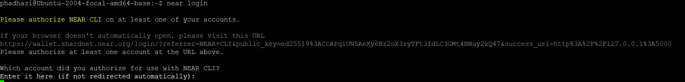
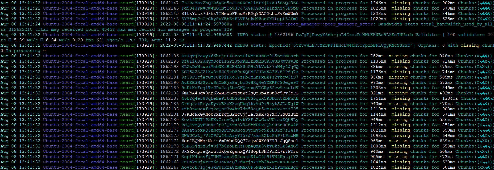
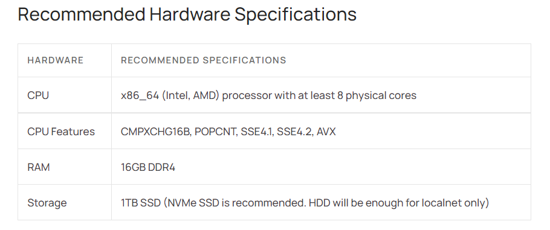
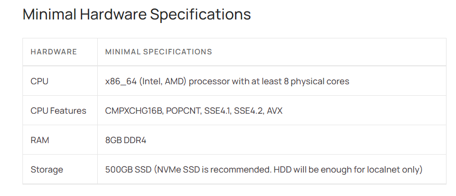
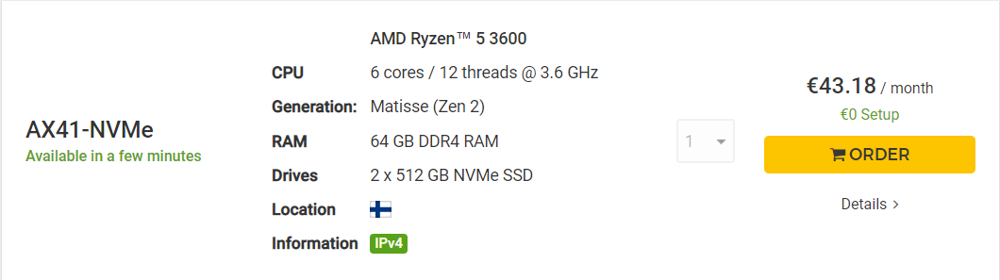
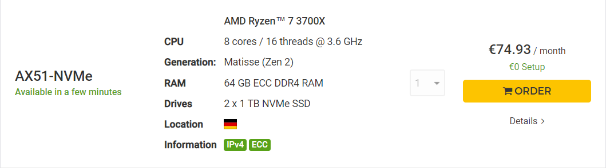

# near-stakewars3

# Stake Wars: Episode III. Challenge 005

```
<userId>: phadhazi
<account_id>: phadhazi.shardnet.near
<pool_name>: phadhazi
<pool_id>: phadhazi.factory.shardnet.near
```
- Update linux installation
- Install near-cli
- Prepare environment for install

```
sudo apt update && sudo apt upgrade -y
# install nodejs
curl -sL https://deb.nodesource.com/setup_18.x | sudo -E bash -  
sudo apt install build-essential nodejs
PATH="$PATH"
# versions
node -v
npm -v
#near-cli
sudo npm install -g near-cli
# param setup
export NEAR_ENV=shardnet
echo 'export NEAR_ENV=shardnet' >> ~/.bashrc

# test near cli
near proposals
near validators current
near validators next
```

- Create a wallet : https://wallet.shardnet.near.org/
- Use the naming conventions described at the begining of the documentation.


```
#install dependencies
sudo apt install -y git binutils-dev libcurl4-openssl-dev zlib1g-dev libdw-dev libiberty-dev cmake gcc g++ python docker.io protobuf-compiler libssl-dev pkg-config clang llvm cargo python3-pip

USER_BASE_BIN=$(python3 -m site --user-base)/bin
export PATH="$USER_BASE_BIN:$PATH"

sudo apt install clang build-essential make
# remove rust to avoid version collusion
sudo apt remove rustc
# install again
curl --proto '=https' --tlsv1.2 -sSf https://sh.rustup.rs | sh
source $HOME/.cargo/env
# git
git clone https://github.com/near/nearcore
cd nearcore
git fetch

# checkout latest commitId
# use : https://github.com/near/stakewars-iii/blob/main/commit.md
git checkout 8448ad1ebf27731a43397686103aa5277e7f2fcf
# build/init
cargo build -p neard --release --features shardnet
./target/release/neard --home ~/.near init --chain-id shardnet --download-genesis

mv config.json config_renamed_original.json
wget -O ~/.near/config.json https://s3-us-west-1.amazonaws.com/build.nearprotocol.com/nearcore-deploy/shardnet/config.json
# genesis file is beside config, download it if needed

# aws cli
sudo apt-get install awscli -y

# start it and let it run to synch and catch-up
cd ~/nearcore
./target/release/neard --home ~/.near run

# login, use your account id to allow near to use your wallet
near login
# generate validator keys
near generate-key <pool_name>.factory.shardnet.near
# copy generated key to its place
cp ~/.near-credentials/shardnet/<accountId>.shardnet.near.json ~/.near/validator_key.json
# Change in validator_key.json private_key to secret_key

```

- Set up service as daemon

```
target/release/neard run
sudo vi /etc/systemd/system/neard.service
```
Paste and replace < userId >
```
[Unit]
Description=NEARd Daemon Service

[Service]
Type=simple
User=<userId>
#Group=near
WorkingDirectory=/home/<userId>/.near
ExecStart=/home/<userId>/nearcore/target/release/neard run
Restart=on-failure
RestartSec=30
KillSignal=SIGINT
TimeoutStopSec=45
KillMode=mixed

[Install]
WantedBy=multi-user.target
```

```
sudo systemctl enable neard
sudo systemctl start neard
# check log
sudo journalctl -n 100 -f -u neard | ccze -A

```

- After near login to complete it type your near address

- Create Staking pool, deposit, ping, check results

```
# Create staking pool
near call factory.shardnet.near create_staking_pool '{"staking_pool_id": "<pool_name>", "owner_id": "<account_id>", "stake_public_key": "<PUBLIC_KEY>", "reward_fee_fraction": {"numerator": 5, "denominator": 100}, "code_hash":"DD428g9eqLL8fWUxv8QSpVFzyHi1Qd16P8ephYCTmMSZ"}' --accountId="<account_id>" --amount=30 --gas=300000000000000

# Deposit and stake NEAR
near call <poolId> deposit_and_stake --amount 460 --accountId <accountId> --gas=300000000000000

# Get staked balance
near view <poolId> get_account_staked_balance '{"account_id": "<accountId>"}'

# Create proposal with ping
near call <poolId> ping '{}' --accountId <accountId> --gas=300000000000000

# Check validator is within proposals
near proposals | grep <pool_name>
```

- Example :

```
# Create staking pool
near call factory.shardnet.near create_staking_pool '{"staking_pool_id": "phadhazi", "owner_id": "phadhazi.shardnet.near", "stake_public_key": "ed25519:2z45mqZhWAnMnrgBZe13cb1CvzxmWsGLUYHRMPzYV4Vw", "reward_fee_fraction": {"numerator": 5, "denominator": 100}, "code_hash":"DD428g9eqLL8fWUxv8QSpVFzyHi1Qd16P8ephYCTmMSZ"}' --accountId="phadhazi.shardnet.near" --amount=30 --gas=300000000000000

# Deposit and stake NEAR
near call phadhazi.factory.shardnet.near deposit_and_stake --amount 460 --accountId phadhazi.shardnet.near --gas=300000000000000

# Get staked balance
near view phadhazi.factory.shardnet.near get_account_staked_balance '{"account_id": "phadhazi.shardnet.near"}'

# Create proposal with ping
near call phadhazi.factory.shardnet.near ping '{}' --accountId phadhazi.shardnet.near --gas=300000000000000

# Check validator is within proposals
near proposals | grep phadhazi
```


- Check logs, delegators, validators, blocks

```
# check logs
sudo journalctl -n 100 -f -u neard | ccze -A

# rpc calls
curl -s http://127.0.0.1:3030/status | jq .version
# check delegators / stake command
near view <poolId> get_accounts '{"from_index": 0, "limit": 10}' --accountId <userId>
# why validator have benn kicked out
curl -s -d '{"jsonrpc": "2.0", "method": "validators", "id": "dontcare", "params": [null]}' -H 'Content-Type: application/json' 127.0.0.1:3030 | jq -c '.result.prev_epoch_kickout[] | select(.account_id | contains ("<pool_name>"))' | jq .reason
# Check Blocks Produced / Expected Command - all active validators
curl -s -d '{"jsonrpc": "2.0", "method": "validators", "id": "dontcare", "params": [null]}' -H 'Content-Type: application/json' 127.0.0.1:3030 | jq -c '.result.current_validators[]'
# filter on your account
curl -s -d '{"jsonrpc": "2.0", "method": "validators", "id": "dontcare", "params": [null]}' -H 'Content-Type: application/json' 127.0.0.1:3030 | jq -c '.result.current_validators[] | select(.account_id | contains ("pool_name"))'
```

### Pricing


### Hetzner




